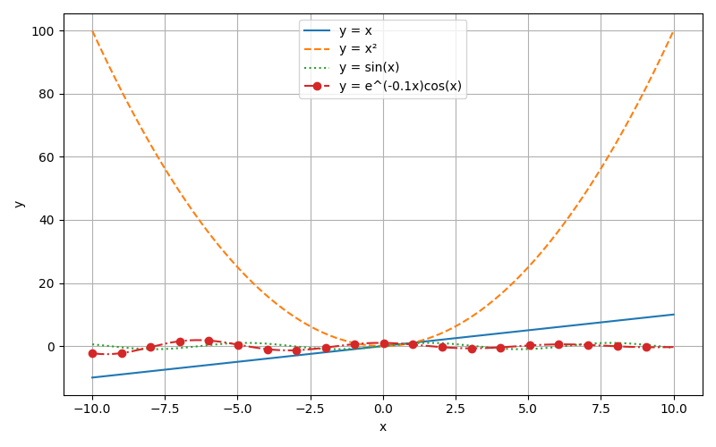
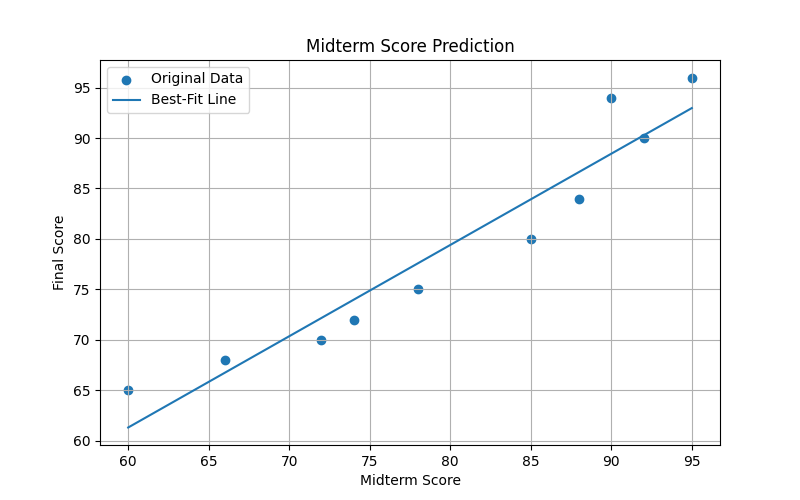

# Math Visualization Assignment

A Python project that visualizes mathematical functions and student score data using NumPy and Matplotlib.

---

## Project Description

This project covers four visualization tasks:
- Plotting multiple mathematical functions on a single figure
- Creating a custom equation plot
- Visualizing student score data with scatter plots, histograms, and bar charts
- Fitting a linear prediction line to score data and making predictions

All plots are generated in a Jupyter Notebook (`math_visualization.ipynb`) and saved as PNG files.

---

## Libraries Used

| Library | Purpose |
|---|---|
| `numpy` | Numerical computation, array operations, polynomial fitting |
| `matplotlib` | Plotting and saving all visualizations |

Install them with:
```bash
pip install numpy matplotlib
```

---

## How to Run

1. Clone the repository:
   ```bash
   git clone https://github.com/YOUR_USERNAME/math-visualization-assignment.git
   cd math-visualization-assignment
   ```

2. Open the notebook:
   ```bash
   jupyter notebook math_visualization.ipynb
   ```

3. Run all cells (Kernel → Restart & Run All). The following PNG files will be generated automatically:
   - `function_plot.png`
   - `own_equation.png`
   - `score_scatter.png`
   - `score_histogram.png`
   - `score_bar_chart.png`
   - `score_prediction.png`

---

## Output Screenshots

### Task 1 — Mathematical Function Visualization


### Task 4 — Best-Fit Prediction Line


---

## Prediction Results (Task 4)

Using `np.polyfit`, a linear model was fit from midterm scores to final scores:

```
Predicted final score for midterm = 50:  52.26
Predicted final score for midterm = 75:  74.88
Predicted final score for midterm = 100: 97.49
```

---

## Reflection

**How does visualization help us understand mathematical functions and data?**  
Visualization turns abstract numbers and equations into shapes we can immediately read. For example, plotting y = x², y = sin(x), and y = e^(−0.1x)cos(x) side by side makes it easy to compare their growth rates, periodicity, and ranges at a glance — something that would be very hard to grasp from equations alone. With the student score data, a bar chart instantly shows who scored highest and lowest, while a histogram reveals how scores are distributed across the class.

**Which plot was most useful in this assignment and why?**  
The best-fit scatter plot in Task 4 was the most useful. It combines raw data with a predictive model in one view, making it easy to see both how closely the two scores correlate and how well the linear model fits. It also produces actionable output — concrete predicted final scores for any given midterm score.

**What is the role of NumPy and Matplotlib in this project?**  
NumPy handles all the math: generating evenly spaced x values with `np.linspace()`, computing array-based equations efficiently, and fitting the linear model with `np.polyfit()`. Matplotlib takes those arrays and turns them into visual plots, giving control over line styles, labels, legends, grids, and file output. Together they form the backbone of scientific visualization in Python.
